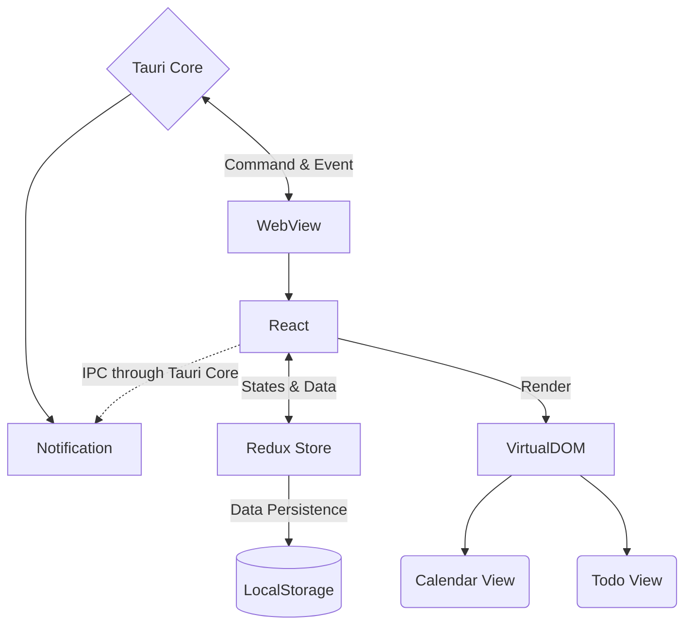

<h1>
  

    <samp>
      twain
    </samp>
  

</h1>

Project twain would like to integrate a regular to-do list app (tasking) with a calendar app (scheduling) to make a smooth experience for daily tasking and scheduling.

## Architecture

Version `0.1` :

