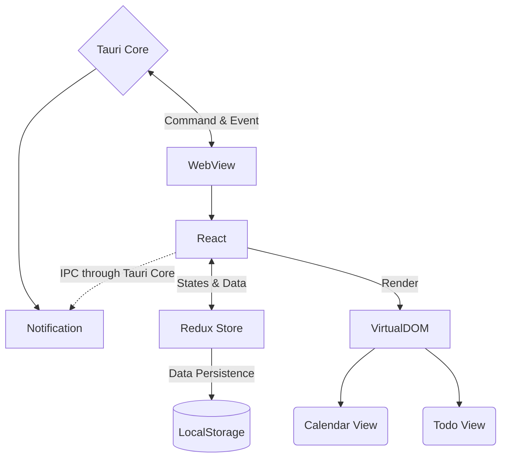

<h1>
  

    <samp>
      CalItDone
    </samp>
  

</h1>

Project CalItDone integrates To-Do list app (tasking) with Calendar app (scheduling) to make a smooth experience for
daily tasking and scheduling.

## Branches

- `main` : stable branch
- `dev` : active development
- `feat/*` : modular feature development
- `fix/*` : bug fix branch
- `release/*` : release version

## Architecture

Version `0.1` :

## Tech Todo
## Infrastructure
- [x] React (TypeScript)
- [x] Tauri
- [ ] Redux
- [x] React-Router

## Toolchain
- [ ] husky
- [ ] lint-staged
- [ ] stylelint
- [ ] prettier
- [ ] commitlint