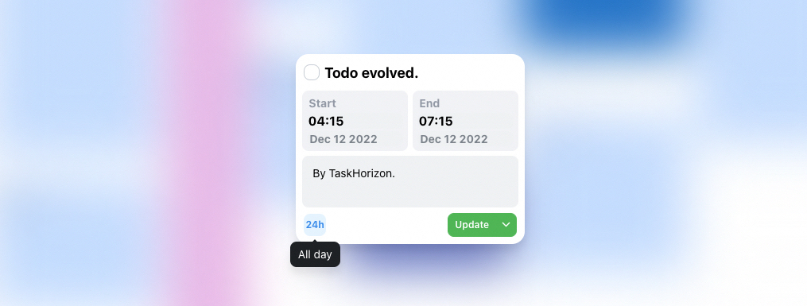

<h1>
<div align="center">
    <br />
<!--
    <samp>
      TaskHorizon
    </samp>
-->
  </div>
</h1>
<p align="center">
  <em>
    Schedule your tasks and events in one place.
  </em>
</p>




TaskHorizon is a productivity app that combines To-do and Calendar functionality to enable effective daily task management and scheduling, providing a seamless experience for users. We are currently focused on developing the web and macOS versions of the app, with several exciting new features in the pipeline.

> **Warning**
> This project is currently in the early prototyping phase and the data integrity has not been fully validated. Please exercise caution when using the prototype.

See [Planned Roadmap](docs/Roadmap.md) and [Project real-time Roadmap](https://jabriel.notion.site/404ec6d1dd084c17a4a877afc327ee47) for latest updates.

### Monorepo
- `client` the Tauri x Web app
- `server` the backend server based on ts.ed and express.js
## Branches

- `main` : stable branch
- `dev` : active development
- `feat/*` : modular feature development
- `fix/*` : bug fix branch
- `release/*` : release version

## Architecture

### Client

Version `0.2 (draft)` :

```mermaid
graph TB;
    A{Tauri Core} <-- Command & Event --> B[WebView]
    A --> Notification
    B --> React[React] <-- States --> store[Zustand Store] -- Data Persistence --> ls[(LocalStorage)]
    React -- Render --> vdom[VirtualDOM]
    vdom --> al(Application Layout)
    al --> cv(Calendar View)
    al --> tv(TodoList View)
    al --> us(UserSettings view)
    React -- IPC through Tauri Core .-> Notification
    store -- Data Fetching --> ch[Custom Hooks] -- SWR --> axios[Axios XMLHttpRequests]
    React -- APIs --> axios
    
```

### Frontend

TODO

### Backend

TODO

## Development

Setup Tauri development [prerequisites](https://tauri.app/v1/guides/getting-started/prerequisites) first.

```shell
# install dependencies
pnpm i

# start web dev server
pnpm dev

# start Tauri dev window
# -- it will start both web dev server and Tauri dev window
pnpm tauri dev

# build for production
pnpm tauri build
```

## Framework

### Infrastructure

| Name                                         | Description                                     |
|----------------------------------------------|-------------------------------------------------|
| [Tauri](https://tauri.app/)                  | Cross-platform framework (Electron alternative) |
| [React](https://reactjs.org)                 | Frontend UI framework                           |
| [React Router](https://reactrouter.com)      | Routing for React                               |
| [Zustand](https://github.com/pmndrs/zustand) | State Management                                |

### User Interface

| Name              | Description            |
|-------------------|------------------------|
| Tailwind CSS      | Custom UI Components   |
| Mantine           | UI Component and hooks |
| styled-components | Custom UI Components   |
| Semi-UI           | UI Components          |

### DX

| Name                   | Description                    |
|------------------------|--------------------------------|
| ESLint                 | Linting                        |
| Prettier               | Code formatter                 |
| Stylelint              | CSS linter                     |
| Husky                  | Git hooks                      |
| lint-staged            | Git hooks                      |
| Commitizen             | Git commit convention          |
| Tailwind Config Viewer | Tailwind config and cheatsheet |

## Modules

> WIP

- Tasking List App
- TodoEvent (Tasking + Event) Data Structure
- Calendar View
- Data Persistence
- Prisma, Prisma client rust, LocalForge, Zustand
