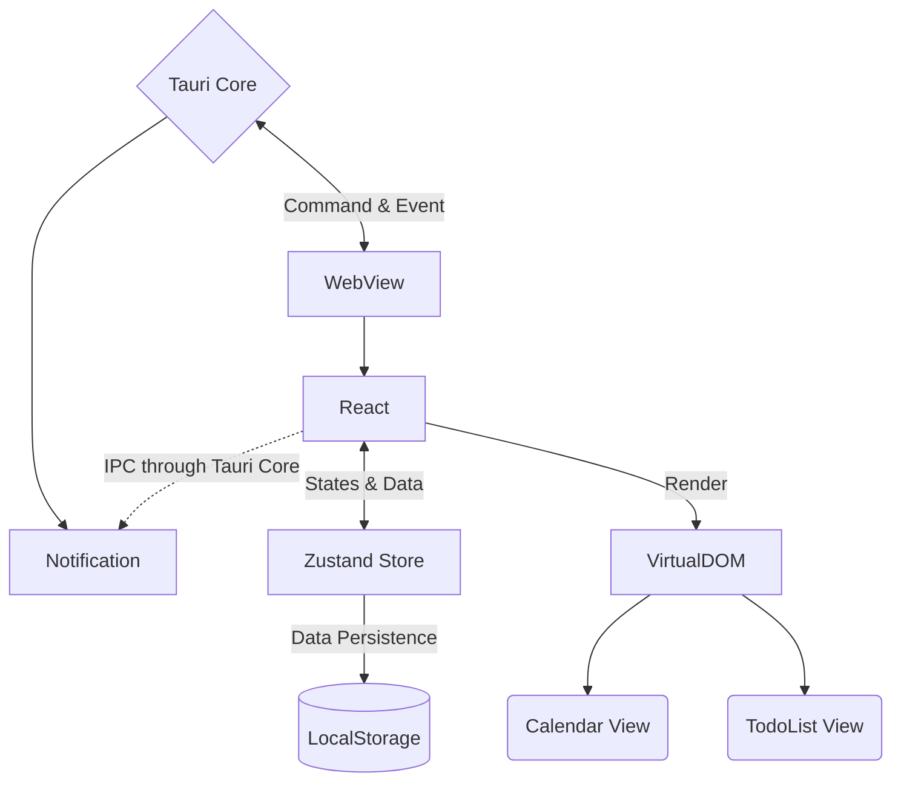

<h1>
  <p align="center">
    <samp>
      Calitdone
    </samp>
  </p>
</h1>

Project Calitdone integrates To-Do list app (tasking) with Calendar app (scheduling) to make a smooth experience for
daily tasking and scheduling.

## Branches

- `main` : stable branch
- `dev` : active development
- `feat/*` : modular feature development
- `fix/*` : bug fix branch
- `release/*` : release version

## Roadmap

TODO

## Architecture

### Client

Version `0.2 (draft)` :



### Frontend

TODO

### Backend

TODO

## Development

```shell
# install dependencies
pnpm i

# start web dev server
pnpm dev

# start Tauri dev window
# -- it will start both web dev server and Tauri dev window
pnpm tauri dev

# build for production
pnpm tauri build
```

## Framework

### Infrastructure

| Name                                         | Description                                     |
|----------------------------------------------|-------------------------------------------------|
| [Tauri](https://tauri.app/)                  | Cross-platform framework (Electron alternative) |
| [React](https://reactjs.org)                 | Frontend UI framework                           |
| [React Router](https://reactrouter.com)      | Routing for React                               |
| [Zustand](https://github.com/pmndrs/zustand) | State Management                                |

### User Interface

| Name              | Description          |
|-------------------|----------------------|
| Tailwind CSS      | Custom UI Components |
| Semi-UI           | UI Components        |
| styled-components | Custom UI Components |

### DX

| Name                                                                       | Description                    |
|----------------------------------------------------------------------------|--------------------------------|
| Prettier                                                                   | Code formatter                 |
| Stylelint                                                                  | CSS linter                     |
| Husky                                                                      | Git hooks                      |
| lint-staged                                                                | Git hooks                      |
| Commitizen                                                                 | Git commit convention          |
| [Tailwind Config Viewer](https://github.com/rogden/tailwind-config-viewer) | Tailwind config and cheatsheet |

## Modules

> WIP

- Tasking List App
- TodoEvent (Tasking + Event) Data Structure
- Calendar View
- Data Persistence
- Prisma, Prisma client rust, LocalForge, Zustand

## TODO

See [TODO](docs/TODO.md).