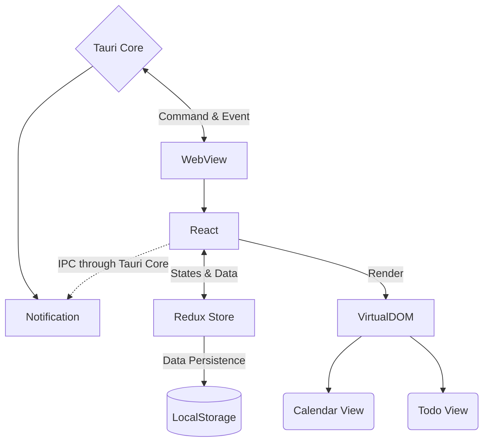

<h1>
  <p align="center">
    <samp>
      Calitdone
    </samp>
  </p>
</h1>

Project Calitdone integrates To-Do list app (tasking) with Calendar app (scheduling) to make a smooth experience for
daily tasking and scheduling.

## Branches

- `main` : stable branch
- `dev` : active development
- `feat/*` : modular feature development
- `fix/*` : bug fix branch
- `release/*` : release version

## Architecture

Version `0.1 (draft)` :



## Development

```shell
# install dependencies
pnpm i

# start web dev server
pnpm dev

# start Tauri dev window
# -- it will start both web dev server and Tauri dev window
pnpm tauri dev

# build for production
pnpm tauri build
```

## Infrastructure

- [x] React (TypeScript)
- [x] Tauri
- [ ] Redux
- [x] React-Router

## Framework

- [x] TailwindCSS (PostCSS)
- [x] semi-ui
- [ ] ...

## Dev Toolchain

- [x] husky
- [x] lint-staged
- [x] stylelint
- [x] prettier
- [x] commitlint
- [x] commitizen (czg)

## Modules
> WIP

- Todo List App
- TodoEvent (Todo + Event) Data Structure
- Calendar View
- Data Persistence
- Prisma, Prisma client rust, LocalForge, Redux

## Thoughts
- three types: event, todo, eventodo
- make interfaces for them
- todo is simple, just a few words
- drag and drop how to do it
  - a custom event card is needed